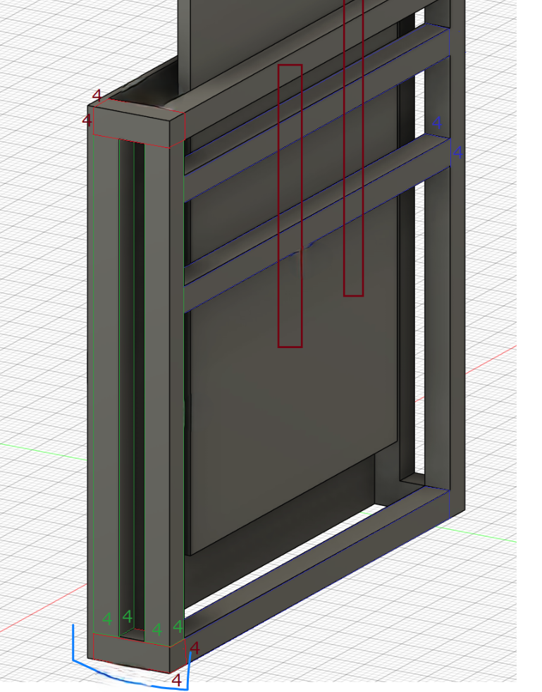

# Introduction 
This document will show all the process I went through building this controller. I don't think this should be called a tutorial, more just like a showcase of how could this be done. There are many ways you can do this, this is just one way to it.

# License
License is CC-NC so you can modify and use it any way other than making money from it.

# First batch of things to buy
## Buttons
### Taobao
I went for the only option that was reachable for me, taobao buttons, you can find them by searching `舞萌按键`. With this method you can also buy official spacers but they are easily 3D printable. To get higher quality buttons, try asking people for "Rabbit Buttons" as they are higher quality than most of the ones that are on taobao

### Bluespringexpress
Now there is also another method, wchich is buying them from [bluespringexpress.net](https://bluespringexpress.net)
### External sourcing, private sellers
There is some chance you can find some private sellers on rhythm game cabs discord so if its worth trying

## Wood
The core of where buttons, cables and glass are connected. I suggest going for plywood 80x80 cm, it can be bigger or smaller but remember that minimum is 70x70 or 60x60 if you only want to play on the touch (it is possible but not reccomended because in some cases you need to use button in the game). Second option could be HDF sheet, basically same thing but on plywood it's easier to screw in buttons and spacers. I went with one cm thick but it could be more if i would say

## Glass
I came up with an idea of hexagonal glass with the dimensions below. It can be honestly whatever you want, whether it is square or hexagon. Remeber though about cables plus that diameter of circicle on arcade size controller is 52cm and you need some more space to mount it. I went with 4mm hardened glass, but if you can find minimum would be 3mm if it's more conventional. Provide glass making service with your dimensions or cut it out from paper and give it to them on place if possible. 

## ITO film
I ordered mine from taobao with proxy service to Europe, but found similar option on aliexpress so go with whatever suits you better. [Here is link to one i bought from tabao](https://m.tb.cn/h.5OVbLeX?tk=HFfzWfSNlO3) . Main thing you are looking for is 1 square meter, with applied glue on one side. About resistance, I have no clue that it changes but i went with 150ohm. 

## TV and mount
Highly reccomended to buy it early to get measurements for later. 43 inch is DX size which this project is all about so accquire one. No need to go for 120hz as it is cashgrab and the game sucks on 120hz anyway, so dont overpay. If you want to save it later for ADX from yuancon try to find one that is less than 6.4cm thick or on this list https://docs.google.com/spreadsheets/d/1WN50pyJEPpXR32UTsEzsKe4Qm-EUAQgwmkCBX3kWB1Q/edit?gid=0#gid=0. About the mount, try to find anything as flat as possible without any additional motion addons. Espacially good one would be one with a lot of holes as it will be used to screw it to aluminum profiles.
 
## Electronics and Rest

### PCBs
Buttons: I ordered one form tabao but recently seen on aliexpress as well here are links

Touch: Mai_pico by whowechina is easiest to go for right now go and build it but remember not to solder mpr121 to pcb and to use 90 degree connector as shown here. You can also use this pcb for buttons but i just had another one earlier so I just used the already premade one. If you want to go for arduino one, remember to go for 3.3v version or obtain level shifter as mpr121 onyl operates at 3.3v.

If you go for arduino one here is everything you need to know about how to connect everything: 
>First of all, since mpr121 is connected to the main control through the I2C bus, each mpr is connected in parallel, that is
>The vcc (3.3v) of each mpr are connected together and connected to the VCC of the main control
>The GND of each MPR is connected together and connected to the GND of the main control.
>The SDA of each mpr is connected together and connected to the SDA of the main control. If you don’t know which pin of the main control is SDA, please search the main control board name + pinout on Google, or search the main control board name + pin definition on Baidu
>The SCL of each mpr is connected together and connected to the SCL of the main control. If you don’t know which pin of the main control is SCL, please search the main control board name + pinout on Google, or search the main control board name + pin definition on Baidu
>But please note that the I2C bus identifies devices through addresses. Each piece of mpr has the same address when it is purchased. You need to manually switch the address. The specific method is:
>Find the ADD jumper of the mpr you bought. It is probably short-circuited by default (the default ADD is shorted to GND, address 0x5A). Please use a knife, screwdriver or other sharp object to cut (cut) the short-circuited wire. Please be sure Carve carefully and accurately, making sure the jumper is completely cut off and not damaging >other circuits. Then the board should lead to the ADD interface. ADD shorts GND, VCC, SDA, and SCL to obtain the addresses 0x5A, 0x5B, 0x5C, and 0x5D respectively.

### Cables, wires, and connectors

-8 of 3 pin female to female connector for buttons.
-3 of 6 pin female to female connector for mpr. Reccomended 50cm or less due to i2c communication limits.
-Bunch of other female to whatever cables, 100cm for connecting ito touch zones to mpr
-Copper wire 0.07mm or 0.1mm, just anything in the similar size
-90 Degree male pin connector 2.54mm

### Screws and glass holders
Anything that will hold your buttons and spacers without going through the wood and potentially damaging glass or cables
To hold your glass use anything silimar to this

# First assembly
## Cut circle in wood
Go to your nearest place where it can be done and ask for circle in the exact center of your wood that is 52cm diameter.
## Engrave space for glass (Optional)
This is optional stuff to make sure that your glass is not moving. Find the nearest service where it can be done and engrave the exact same size from the center for 1mm less than your glass thickness. 

## Screw in spacers and buttons
I reccomend starting from spacers as it is easier to get them in correct place with simple measurements, so place them in the right place and outline with for example pencil. Then install buttons between those outlines. Remember there should be minimal space between buttons and spacer so it isnt like 100% fit into. Or maybe i had but cutting service of circle, whatever. After this step remember to drill out holes for buttons cables go to back of the board and check if there are any screws that went through to the other side and sand them of or however you like to do it

 

## Cut ITO
### First option - Tested, works great, file with cad shapes is in main
There are many designs for ITO as you can see here but i went with this one, which is only cutting zones and then connecting them via thin wire and tape. Doesnt look as clean as second option but my priority was performance over looks

### Second option - Tested, doesnt work great, for me unplayable
Second option was my initial design, which is cutting ito with traces and then connecting them to wires outside of vision field. This didnt turn out great, i dont know whether because of firmware or whatever it was, i just gave up on this.

### Other options
Other options can be found here, this was very helpfull for me, when there was no english documentations of maimai controllers

[https://github.com/NaiXi2233/dkmaiproj/blob/main/tn/2.md](https://github.com/NaiXi2233/dkmaiproj/blob/main/tn/2.md)

## Glue ITO
Can be easily done without glueing on water, i would reccomend it as from what i heard, ITO with water isn't a great combination. Remeber here to take the protective part off only after you are done with glueing everything

## Mount glass to wood
Whether or not you are planning to mount it with engraved part or not it is optional to put something underneath glass. I personally used eva foam for that.

Then i supported glass from underneath with this. You can obviously go for anything that works and doesnt take so much space, remeber about TV underneath glass.

## Electronic and rest
### Mprs

### Board, mai_pico and maimaiTouchControl

### Connecting
First what I did was tape wires to mprs like that,

then left some wire to connect it to cables that go from mpr touch electrodes. Then I placed mpr121s in positions that i think were optiomal and connected them to main board. Remember here to place them maximally 40/50cm from your board as this will make troubles with i2c communication. Then i used hot glue to make them stay in one place. Then I used 1m cables to connect thin wires on glass to mpr121 touch electrodes. Finally I glued everything that could fall of from the wood when placed vertically using hot glue gun. One thing to note here is that my problem was that I had to somehow manage to make cables from mpr121 electrode to glass not touch each other as this was interfering with signal of what is touched and what not. Reserve space for aluminum connectors they will be in four places two at the bottom an two at the top.

## Assembly TV and mount
Do this and take measures as this will be important to order proper size of aluminum extrusions. You wont need to move this anyway after assembly. This will tell you how thick the total thing, note that you need +-2 cm of space betweend screen and glass

# Second batch of things to buy
## Aluminum extrusions
Refer to this image and take measures for your size of wood. 

Remeber here to take more connectros as you need to connect it to your extrusions as well as connecting wood to extrusions. 
## Screws to connect wood to extrusions
Take four long screws that will go thorugh wood and a bit longer, as well as nut to tight it from other side and make it stable. Pick a size according to your extrusions.

# Second assembly
## Making frame
There are many tutorial on how to do it and it varies from one extrusion vendor to another so you need to figure it out by yourself. 

## Button pcb
I added it on the back as it was very convinient for me but it depends on how you are planning to make it work, wheter using special board for buttons or built in mai_pico

## Connecting wood to frame
First i made holes in wood, then put screw in it, then from the back i placed frame next to it and places extrusion connector and screwed it to stay still in one place. Than i screwed it to frame. You can honestly do it hoverew you want. The end result should look like this. By the way, using this bolts and nuts is most convenient way to acces insides in case you need to do it.

## Final touches
Final thing I did was to add eva foam on the top to ensure that I wont damage walls.

# Final note and external resources
Here you are, done and complete. This project took me way too long, mainly because there was no source like the one that I made here, so enjoy!

I cut ito based of whowechina's mai_pico project and it's files so huge thanks to him for his work https://github.com/whowechina/mai_pico

If you want to learn more about other options of maimai controller making here is great portion of knowlege from china https://github.com/NaiXi2233/dkmaiproj/blob/main/tn/2.md

Here is channel of one guy who build this whole thing and recorded it so maybe something to get inspiration https://space.bilibili.com/286413610?spm_id_from=333.788.0.0
